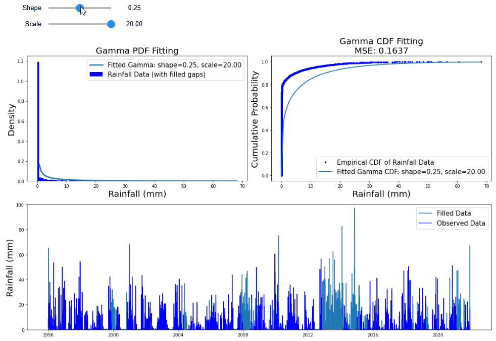
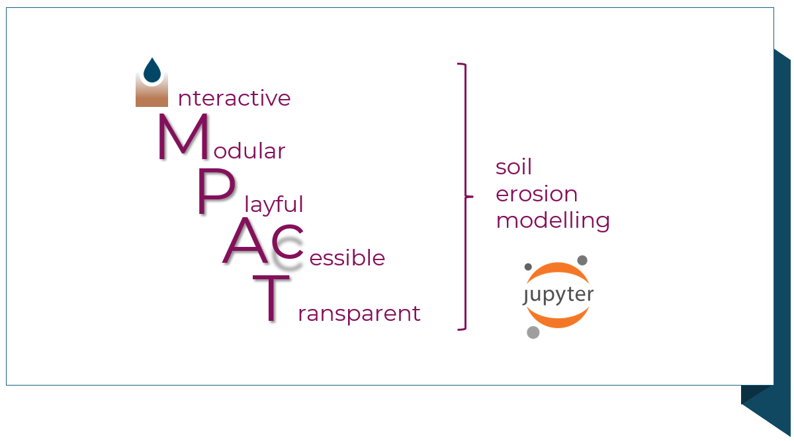

iMPACT-erosion is a project that aims to **democratise** soil erosion modelling by fostering a more **educational, playful and exploratory** experience. To achieve this goal, the project adopts a **learn-by-doing** approach, allowing users of varying modeling expertise – **from novices to experts** – to get familiar with soil erosion modeling concepts and procedures simply by interacting with modelling tools.

iMPACT-erosion offers a comprehensive set of **interactive Jupyter Notebooks** and **Python functions** that guide users through the entire hydrological + soil erosion modelling process. These resources are organized into three stages: **Start, Test and Explore**

Important: we have included links to run iMPACT Notebooks on the cloud by using [Binder](https://mybinder.org/), so that they are accessible by a web browser **without requiring any local installation**.

### [**1. iMPACT-Start**](https://impact-erosion.github.io/iMPACT-Start.html)

The iMPACT-Start is a set of Notebooks explaining and implementing the starting soil erosion modelling tasks: fill climate data gaps, fill sinks of the digital elevation model (DEM), calculate the flow accumulation of the surface water flow, catchment delineation to define the area of study and soil erosion modelling at the catchment scale

You can run them online here: [iMPACT-Start](https://impact-erosion.github.io/iMPACT-Start.html)

You can download them from the iMPACT-erosion Github repository: [iMPACT-Start Github](https://github.com/iMPACT-erosion/iMPACT-erosion/tree/main/iMPACT-Start/)

### [**2. iMPACT-Test**](https://impact-erosion.github.io/iMPACT-Test.html)

The iMPACT-test is a set of Notebooks explaining and implementing the necessary tasks to calibrate and evaluate a soil erosion model: optimal soil sampling, spatial interpolation of sampled data, automatic and manual model calibration, sensitivity and uncertainty analysis.

You can run them online here: [iMPACT-Test](https://impact-erosion.github.io/iMPACT-Test.html)

You can download them from the iMPACT-erosion Github repository: [iMPACT-Test Github](https://github.com/iMPACT-erosion/iMPACT-erosion/tree/main/iMPACT-Test/)

### [**3. iMPACT-Explore**](https://impact-erosion.github.io/iMPACT-Explore.html)

The iMPACT-explore is a set of Notebooks explaining and implementing the necessary tasks to simulate and explore a soil erosion system under different conditions and scenarios, to evaluate the efficiency of mitigation strategies and identify the most influential factors.

## Install iMPACT-erosion locally

To install iMPACT-erosion on your computer: [Install iMPACT-erosion](./Install.md/)

## Github repository

You can download the Notebooks from the iMPACT-erosion Github repository: 

[iMPACT Github repository](https://github.com/iMPACT-erosion/iMPACT-erosion)

## Citation

## Acknowledgements
This project is funded by the European Research Executive Agency (REA) under the HORIZON-MSCA-2021-PF-01 grant agreement 101062258

## License
Copyright (C) 2023 Andres Peñuela. iMPACT-erosion is released under the 

&nbsp;

   

